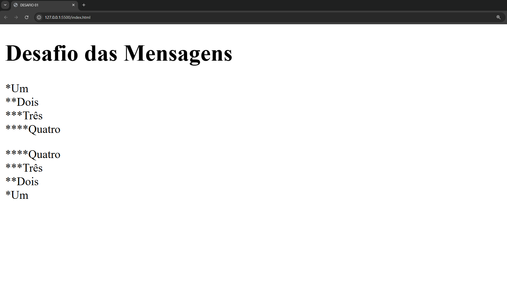

# Desafio 01 - Mensagens

## 📚 Descrição
Exercício do curso de HTML e CSS do Gustavo Guanabara.

O objetivo é exibir textos utilizando apenas parágrafos e quebras de linha.
---

## 🧠 O que foi praticado
- Uso de `
`
- Uso de ` `
- Estrutura básica HTML

---

## 📸 Resultado
